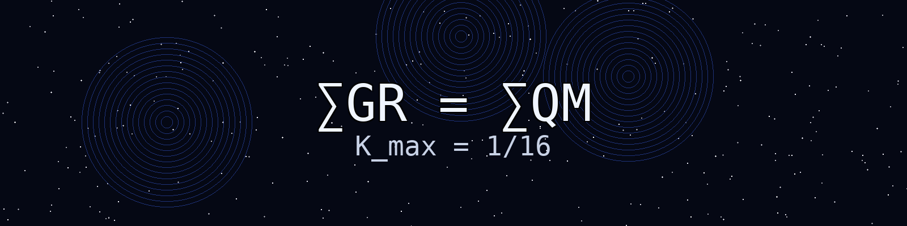

# 🌌 Andrew Rodger

Working on **QCF** — a curvature-capped framework where ∑GR = ∑QM

The Paper, Code and Simulator :
 

> **"The world isn't broken. We’re just running the wrong diagnostics."**

---

### 🪝 The Hook
We spend a vast amount of time trying to "fix" the environment, the economy, and society, as if we are debugging code that was meant to be static. But what if we’re misinterpreting the error logs?

### ⚙️ The Engineering Pivot
When I look at our ecosystem, I see a piece of engineering so fine-tuned it’s breathtaking. Take $H_2O$ vs $H_2O_2$. Add a single oxygen molecule and you turn a life-giving necessity into a caustic toxin. That isn’t just chemistry; that’s a system designed with tolerances so thin, a single bit-flip causes a total phase shift.

### 🏔️ The Hard Truth
* **Natural Oscillations:** We are currently in a geological interglacial period. The ice is retreating, temperatures are fluctuating, and the system is doing exactly what it was designed to do: oscillate. 
* **The Misconception of Emergency:** We treat this as an "emergency" because we equate change with extinction. 
* **The Scale of the Earth:** We are trying to out-engineer a planet’s thermal cycles with carbon credits and wind farms, ignoring the fact that the Earth has survived events that make our current climate fluctuations look like a rounding error.

### 🐛 The "Human Exception"
The real "bug" isn't the planet; it’s us. We are the only species that consumes its own infrastructure and calls it "progress." We act like a parasite that has forgotten it is part of the host.

### ✊ A Call to Agency
I’ve stopped waiting for the "fix." I’ve stopped listening to the doom-mongers who trade in fear because it’s the easiest currency to collect.

I’m focusing on the only thing I can control: the quality of the work I do and the clarity with which I see the world. If we are destined to be a short-lived iteration of life on this planet, I’d rather burn bright as a *rough diamond* than fade away as a fearful spectator of our own decline.

---

### 🧭 The Closer
> **The storm is coming—it always is. Are you building a shelter, or are you learning how to sail?**

### 📄 Quantum Constraint Framework

**Core postulate:** K_max = 1/16 (Planck-normalized curvature cap)

**Why:** If General Relativity and Quantum Mechanics are both summations over the same reality, their totals must converge. At Planck density, curvature can't diverge — it caps.

- 📂 Code & notes: [github.com/andrewrodger73/QCF](https://github.com/andrewrodger73/QCF)
- 📖 Paper: [doi.org/10.5281/zenodo.20615629](https://doi.org/10.5281/zenodo.20615629)

---

*From Airdrie, Scotland. Rough diamond, cutting in public.*
